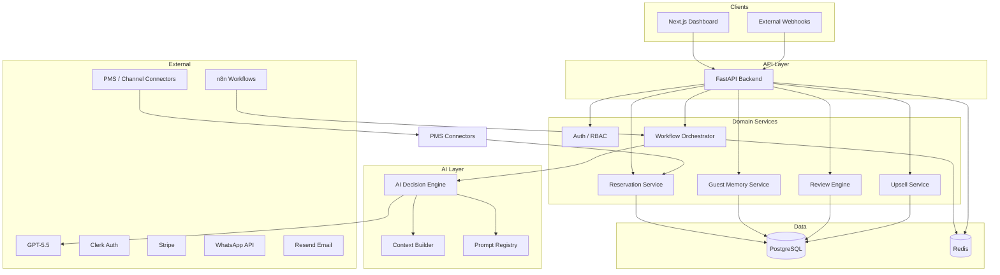

# Re-view — Architecture

**Status:** Planning  
**Last updated:** 2026-08-05

## Principles

- **Clean Architecture** — domain logic independent of frameworks
- **Event-driven** — services communicate via domain events and a message bus
- **Microservices-ready** — modular boundaries today, extractable services tomorrow
- **Single responsibility** — one reason to change per module
- **Thin controllers** — validation and HTTP at the edge; business logic in services

## System Diagram



## Services

| Module | Responsibility | Location |
| --- | --- | --- |
| **API** | REST endpoints, auth middleware, request validation | `backend/` |
| **Connectors** | PMS/channel sync, webhook ingestion | `connectors/` |
| **Agents** | AI decision engine, context builder, output validation | `agents/` |
| **Workflows** | Guest lifecycle orchestration | `workflows/` |
| **Frontend** | Operator dashboard, Server Components | `frontend/` |
| **Infrastructure** | IaC, deployment, observability | `infrastructure/` |

## Data Flow

1. **Reservation sync** — Connector ingests reservation → emits `reservation.created` → Guest profile upserted
2. **Pre-arrival** — Workflow triggers → Context Builder assembles guest + property data → Decision Engine returns structured action JSON → validated → message sent
3. **Stay** — Events (`check_in`, `mid_stay`, `checkout`) drive workflow transitions
4. **Review** — Post-checkout workflow requests review → stores response → feeds Guest Memory
5. **Upsell / repeat** — Decision Engine proposes offers → operator rules or auto-send within policy

## AI Pipeline

```
Event → Context Builder → Prompt (docs/PROMPTS.md) → LLM → JSON Schema Validation → Audit Log → Action Executor (validated only)
```

See [AI_AGENT.md](./AI_AGENT.md) for decision engine details.

## Technology Stack

| Layer | Technology |
| --- | --- |
| Frontend | Next.js, TypeScript, Tailwind, shadcn/ui |
| Backend | FastAPI, Python 3.12, SQLAlchemy, Alembic, Pydantic |
| Database | PostgreSQL |
| Cache / events | Redis |
| AI | GPT-5.5 (structured outputs) |
| Automation | n8n |
| Auth | Clerk |

## References

- [DATABASE.md](./DATABASE.md)
- [API.md](./API.md)
- [CODING_STANDARDS.md](./CODING_STANDARDS.md)
