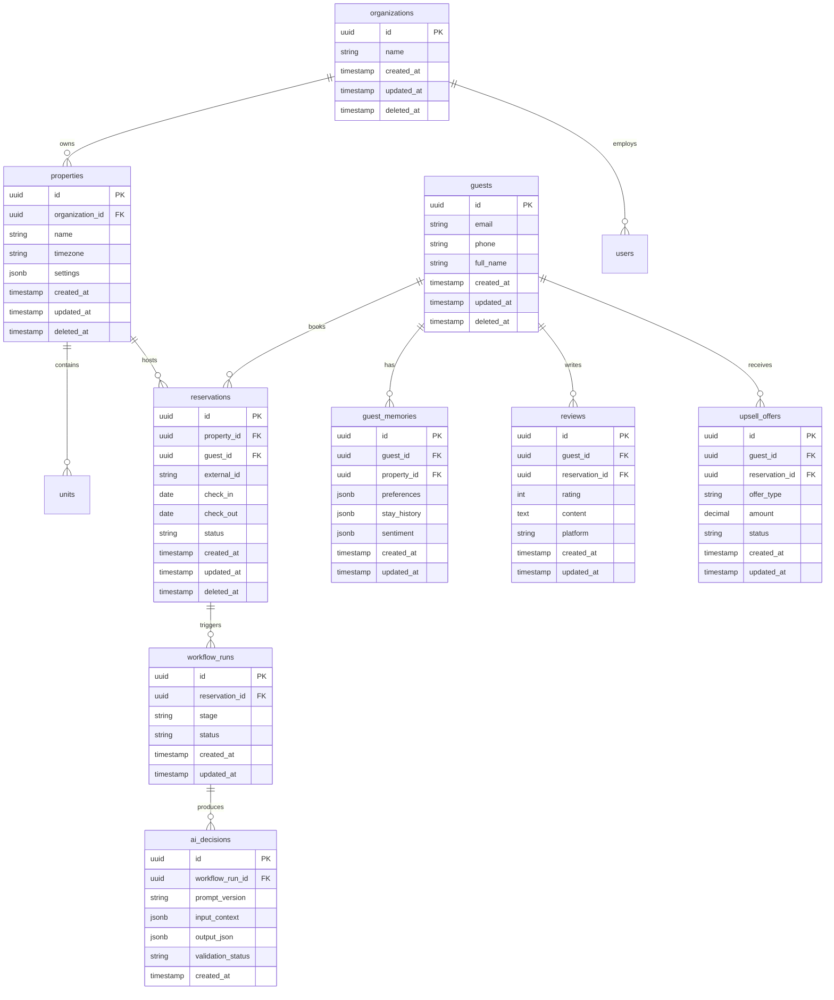

# Re-view — Database

**Status:** Planning  
**Last updated:** 2026-08-05

## Conventions

- **PostgreSQL** as the system of record
- **UUID** primary keys on all tables
- **Soft delete** via `deleted_at` (nullable timestamp)
- **Timestamps** — `created_at`, `updated_at` on every table
- **Indexes** on foreign keys and common query patterns
- **Foreign keys** enforced at the database level
- Normalize first; denormalize only with documented justification
- All schema changes via **Alembic** migrations

## Entity Relationship (Planning)

## Tables (Summary)

| Table | Purpose |
| --- | --- |
| `organizations` | Multi-tenant root |
| `users` | Operator accounts (linked to Clerk) |
| `properties` | Hotels, STRs, portfolios |
| `units` | Rooms / listings within a property |
| `guests` | Guest identity across stays |
| `guest_memories` | Preferences, history, AI context |
| `reservations` | Stays synced from PMS/connectors |
| `workflow_runs` | Lifecycle stage tracking |
| `ai_decisions` | Immutable audit of LLM outputs |
| `reviews` | Captured or synced reviews |
| `upsell_offers` | Generated and accepted offers |
| `connector_sync_logs` | Ingestion audit trail |

## Indexes (Planned)

| Table | Index | Rationale |
| --- | --- | --- |
| `reservations` | `(property_id, check_in)` | Calendar and workflow queries |
| `reservations` | `(external_id, property_id)` UNIQUE | Idempotent connector sync |
| `guest_memories` | `(guest_id, property_id)` | Context builder lookup |
| `ai_decisions` | `(workflow_run_id, created_at)` | Audit and debugging |
| `workflow_runs` | `(reservation_id, stage)` | Stage transitions |

## Migration Policy

1. One Alembic revision per logical schema change
2. Migrations must be reversible where feasible
3. No manual production DDL outside migrations
4. Seed data lives in `scripts/`, not migrations

## References

- [ARCHITECTURE.md](./ARCHITECTURE.md)
- `.cursor/rules/database.mdc`
